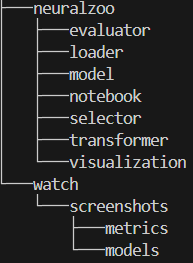

# CIFAR-10 Image Classification Project

## Project Overview

This project focuses on building and evaluating two Deep Learning models for image classification on the **CIFAR-10 dataset**, specifically targeting **animal classes only**.

We compare a **Multilayer Perceptron (MLP)** and a **Convolutional Neural Network (CNN)** using the Keras API.

---

## Dataset

- **Source**: [CIFAR-10 Python version](https://www.cs.toronto.edu/~kriz/cifar.html)
- **Size**: 50,000 color images (32x32 pixels) across 10 classes
- **Filtered classes used in this project**:  
  Animals only (Birds, Cats, Deer, Dogs, Frogs, Horses)

---

## Workflow Summary

### 1. Data Preparation
- Load CIFAR-10 dataset using TensorFlow/Keras API.
- Filter out non-animal classes (Airplanes, Automobiles, Ships, Trucks).
- Normalize pixel values between 0 and 1.
- Apply one-hot encoding on labels.

### 2. Exploratory Data Analysis (EDA)
- Display random images from each animal class.
- Analyze class distribution.
- Visualize sample images using Matplotlib.

### 3. Model Building
We built and trained two different models:

- **MLP Model** (Multilayer Perceptron):
  - Fully connected dense layers.
  - Suitable for flattened input data.

- **CNN Model** (Convolutional Neural Network):
  - Convolutional layers with ReLU activation.
  - Pooling layers (MaxPooling or AveragePooling).
  - Fully connected layers at the end.
  - Dropout and BatchNormalization applied.

### 4. Hyperparameter Tuning
- Performed grid search on the CNN model using **GridSearchCV** from scikit-learn.
- Tuned parameters:
  - Pooling type (max, average)
  - Activation functions (sigmoid, tanh)
  - Number of epochs

### 5. Model Training
- Used **training set** for model fitting.
- Evaluated performance on **validation set** and **test set**.

### 6. Evaluation Metrics
- Accuracy evolution over epochs (training vs validation).
- Confusion Matrix.
- Classification report:
  - Accuracy
  - Precision
  - Recall
  - F1-score
- Overfitting detection and mitigation using:
  - Dropout
  - Early Stopping

### 7. Results
- Comparison of MLP and CNN models based on test accuracy and classification metrics.
- CNN showed better performance for image classification tasks.

## Repository Structure

- **neuralzoo**: The project source folder
    - **notebook/**: Contains Jupyter Notebook for analysis exploratory.
    - **loader/**: Contains python file to load data.
    - **model/**: Contains python files for MLP and CNN models.
    - **notebook/**: Contains Jupyter Notebook for analysis exploratory MLP and CNN models.
    - **selector/**: Contains python file for data selection (by label).
    - **transformer/**: Contains python file for data transformation and preprocessing.
    - **visualization/**: Contains python file for data visualization.
- **watch/**: Contains scientific research and theoretical background (MLP and CNN) and screnshots.

---

## Useful References (Scientific Watch)

- MLP Overview: [./watch/mlp.md](./watch/mlp.md)
- CNN Overview: [./watch/cnn.md](./watch/cnn.md)

---

## Dependencies

- Python 3.10
- TensorFlow / Keras
- scikit-learn
- numpy
- pandas
- seaborn
- matplotlib

## How to Run
- Clone the repository.  
- Install dependencies.  
- Run the notebook inside the `notebooks/` folder.  